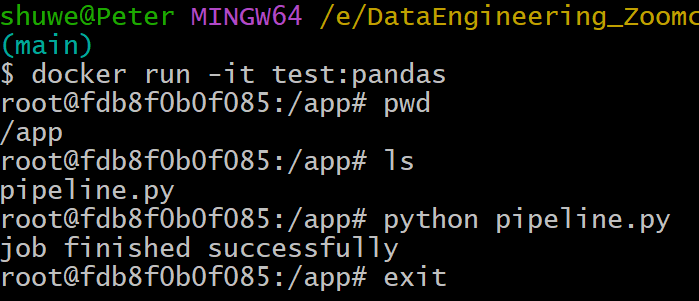
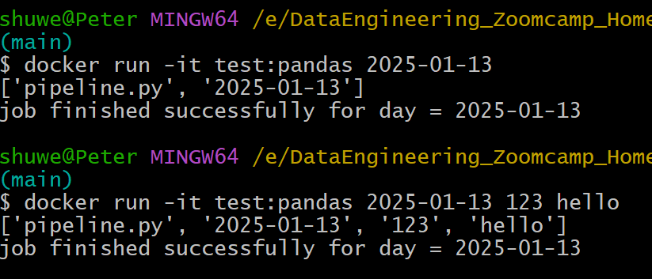

# Procedure 
## Docker setup environment
```bash
1. docker run hello-world
2. docker run -it ubuntu bash
3. docker run -it python: 3.9
4. docker run -it --entrypoint=bash python:3.9 
                `pip install pandas`
                `import pandas`
                `pandas.__version__
```
```bash
5. docker build -t test:pandas .
   docker run -it test:pandas
```
Dockerfile配置: 
``` bash
FROM python:3.9.1

RUN  pip install pandas

ENTRYPOINT [ "bash" ]
```

`6.SOME fancy pandas work:`

create a new file called pipeline.py
```python
import pandas as pd


print('job finished successfully')
```

Dockerfile:
```bash
FROM python:3.9.1

RUN  pip install pandas

WORKDIR /app
COPY pipeline.py pipeline.py

ENTRYPOINT [ "bash" ]
```

```bash
docker build -t test:pandas .
docker run -it test:pandas
```



SOMETHING NEW:
pipeline.py
```python
import sys

# print arguments
print(sys.argv)

day = sys.argv[1]

# print a sentence with the argument
print(f'job finished successfully for day = {day}')
```

Dockerfile配置：
```bash
FROM python:3.9.1

RUN  pip install pandas

WORKDIR /app
COPY pipeline.py pipeline.py

ENTRYPOINT [ "python", "pipeline.py" ]

```

```bash
docker build -t test:pandas .
docker run -it test:pandas 2025-01-13
```



## Running Postgres in a container

Postgres command line for Docker

```bash
docker run -it \
    -e POSTGRES_USER="root" \
    -e POSTGRES_PASSWORD="root" \
    -e POSTGRES_DB="ny_taxi" \
    -v e:/DataEngineering_Zoomcamp_Homework_2025/1.intro/ny_taxi_postgres_data:/var/lib/postgresql/data \
    -p 5432:5432 \
    postgres:13
```

```bash
docker run -it \
    -e POSTGRES_USER="root" \
    -e POSTGRES_PASSWORD="root" \
    -e POSTGRES_DB="ny_taxi" \
    -v $(pwd)/ny_taxi_postgres_data:/var/lib/postgresql/data \
    -p 5432:5432 \
    postgres:13
```
The container needs 3 environment variables:
`POSTGRES_USER` is the username for logging into the database. We chose root.

`POSTGRES_PASSWORD` is the password for the database. We chose root

IMPORTANT: These values are only meant for testing. Please change them for any serious project.

`POSTGRES_DB` is the name that we will give the database. We chose ny_taxi.

`-v` points to the volume directory. 

The colon `:` separates the first part (path to the folder in the host computer) from the second part (path to the folder inside the container).

Path names must be absolute. If you're in a UNIX-like system, you can use pwd to print you local folder as a shortcut; this example should work with both bash and zsh shells, but fish will require you to remove the `$`.

This command will only work if you run it from a directory which contains the ny_taxi_postgres_data subdirectory you created above.

The `-p` is for port mapping. We map the default Postgres port to the same port in the host.

The last argument is the image name and tag. We run the official postgres image on its version 13.

Once the container is running, we can log into our database with pgcli with the following command:

`pgcli -h localhost -p 5432 -u root -d ny_taxi`

`-h` is the host. Since we're running locally we can use localhost.

`-p` is the port.

`-u` is the username.

`-d` is the database name.

The password is not provided; it will be requested after running the command


>**Regarding `wget`**:
>
>可以直接用wget 下载链接中的文件
>
>`wget https://github.com/DataTalksClub/nyc-tlc-data/>releases/download/yellow/yellow_tripdata_2021-01.csv.gz`
>
>如果需要解压可以用
>
>`gunzip yellow_tripdata_2021-01.csv.gz`

## Ingest data to Postgres
see ['upload-data.ipynb'](https://github.com/PeterWang1888/DataEngineering_Zoomcamp_Homework_2025/blob/main/1.intro/upload-data.ipynb)

## Connecting pgadmin and Postgres with Docker Network
pgcli is a handy tool but it's cumbersome to use. pgAdmin is a web-based tool that makes it more convenient to access and manage our databases. It's possible to run pgAdmin as as container along with the Postgres container, but both containers will have to be in the same virtual network so that they can find each other.

Let's create a virtual Docker network called pg-network:

`docker network create pg-network`

You can remove the network later with the command docker network rm pg-network . You can look at the existing networks with docker network ls .

We will now re-run our Postgres container with the added network name and the container network name, so that the pgAdmin container can find it (we'll use pg-database for the container name):

```bash
docker run -it \
    -e POSTGRES_USER="root" \
    -e POSTGRES_PASSWORD="root" \
    -e POSTGRES_DB="ny_taxi" \
    -v e:/DataEngineering_Zoomcamp_Homework_2025/1.intro/ny_taxi_postgres_data:/var/lib/postgresql/data \
    -p 5432:5432 \
    --network=pg-network \
    --name pg-database \
    postgres:13
```

```bash
docker run -it \
    -e POSTGRES_USER="root" \
    -e POSTGRES_PASSWORD="root" \
    -e POSTGRES_DB="ny_taxi" \
    -v $(pwd)/ny_taxi_postgres_data:/var/lib/postgresql/data \
    -p 5432:5432 \
    --network=pg-network \
    --name pg-database \
    postgres:13
 ```

We will now run the pgAdmin container on another terminal:

```bash
docker run -it \
    -e PGADMIN_DEFAULT_EMAIL="admin@admin.com" \
    -e PGADMIN_DEFAULT_PASSWORD="root" \
    -p 8080:80 \
    --network=pg-network \
    --name pgadmin \
    dpage/pgadmin4
```

The container needs 2 environment variables: a login email and a password. We use admin@admin.com and root in this example.
IMPORTANT: these are example values for testing and should never be used on production. Change them accordingly when needed.
pgAdmin is a web app and its default port is 80; we map it to 8080 in our localhost to avoid any possible conflicts.
Just like with the Postgres container, we specify a network and a name. However, the name in this example isn't really necessary because there won't be any containers trying to access this particular container.
The actual image name is dpage/pgadmin4 .
You should now be able to load pgAdmin on a web browser by browsing to localhost:8080. Use the same email and password you used for running the container to log in.

## Coverting the notebook to a Python script


```bash
jupyter nbconvert --to=script upload-data.ipynb
```

n order to test the script we will have to drop the table we previously created. In pgAdmin, in the sidebar navigate to Servers > Docker localhost > Databases > ny_taxi > Schemas > public > Tables > yellow_taxi_data, right click on yellow_taxi_data and select Query tool. Introduce the following command:

`DROP TABLE yellow_taxi_data`;
We are now ready to test the script with the following command:

unzip this downloaded file:
`gunzip green_tripdata_2019-09.csv.gz`

>The command line in the video
>```bash
>python ingest_data.py \
>    --user=root \
>    --password=root \
>    --host=localhost \
>    --port=5432 \
>    --db=ny_taxi \
>    --table_name=yellow_taxi_trips \
>    --url="https://s3.amazonaws.com/nyc-tlc/trip+data/yellow_tripdata_2021-01.csv"
>```

Because of invalid url, we need to unzip the csv file,Therefore,
the command line changed into:
```bash
python ingest_data1.py \
    --user=root \
    --password=root \
    --host=localhost \
    --port=5432 \
    --db=ny_taxi \
    --table_name=yellow_taxi_trips \
    --url="https://github.com/DataTalksClub/nyc-tlc-data/releases/download/yellow/yellow_tripdata_2021-01.csv.gz"
```

Back in pgAdmin, refresh the Tables and check that yellow_taxi_trips was created. You can also run a SQL query to check the contents:

```sql
SELECT
    COUNT(1)
FROM
    yellow_taxi_trips;
```

This query should return `1,369,765` rows.


## Dockerizing the script

Dockerfile: 
```bash
FROM python:3.9.1

# We need to install wget to download the csv file
RUN apt-get install wget
# psycopg2 is a postgres db adapter for python: sqlalchemy needs it
RUN pip install pandas sqlalchemy psycopg2

WORKDIR /app
COPY ingest_data.py ingest_data.py 

ENTRYPOINT [ "python", "ingest_data.py" ]
```

Build the image:

`docker build -t taxi_ingest:v001 .`
And run it:

```bash
docker run -it \
    --network=pg-network \
    taxi_ingest:v001 \
    --user=root \
    --password=root \
    --host=pg-database \
    --port=5432 \
    --db=ny_taxi \
    --table_name=yellow_taxi_trips \
    --url="https://s3.amazonaws.com/nyc-tlc/trip+data/yellow_tripdata_2021-01.csv"
```


## Running Postgres and pgAdmin with Docker-compose

`docker-compose` allows us to launch multiple containers using a single configuration file, so that we don't have to run multiple complex docker run commands separately.

Docker compose makes use of YAML files. Here's the docker-compose.yaml file for running the Postgres and pgAdmin containers:

```bash
services:
  pgdatabase:
    image: postgres:13
    environment:
      - POSTGRES_USER=root
      - POSTGRES_PASSWORD=root
      - POSTGRES_DB=ny_taxi
    volumes:
      - "./ny_taxi_postgres_data:/var/lib/postgresql/data:rw"
    ports:
      - "5432:5432"
  pgadmin:
    image: dpage/pgadmin4
    environment:
      - PGADMIN_DEFAULT_EMAIL=admin@admin.com
      - PGADMIN_DEFAULT_PASSWORD=root
    volumes:
      - "./data_pgadmin:/var/lib/pgadmin"
    ports:
      - "8080:80"
```

- We don't have to specify a network because docker-compose takes care of it: every single container (or "service", as the file states) will run withing the same network and will be able to find each other according to their names (pgdatabase and pgadmin in this example).
- We've added a volume for pgAdmin to save its settings, so that you don't have to keep re-creating the connection to Postgres every time ypu rerun the container. Make sure you create a data_pgadmin directory in your work folder where you run docker-compose from.
- All other details from the docker run commands (environment variables, volumes and ports) are mentioned accordingly in the file following YAML syntax.
- We can now run Docker compose by running the following command from the same directory where docker-compose.yaml is found. Make sure that all previous containers aren't running anymore:

`docker-compose up`